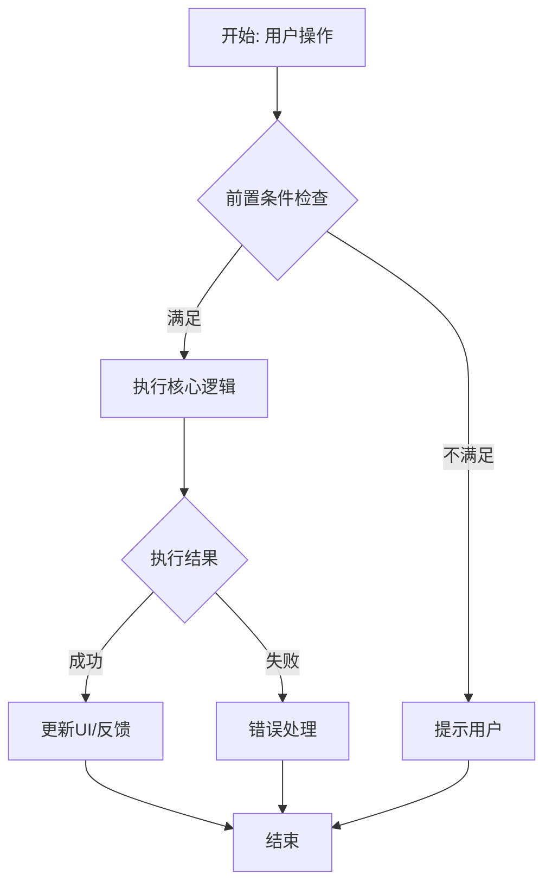

# 游戏编辑器策划案生成 Skill

将策划案编写流程标准化为五个阶段的工作流，确保任何策划人员都能独立完成高质量策划案的编写。

---

## 📋 工作模式识别

收到用户请求后，首先判断属于以下哪种工作模式：

| 模式 | 触发条件 | 执行流程 |
|------|----------|----------|
| **A. 新建策划案** | 用户描述新功能需求，尚无策划案 | 完整执行阶段1→2→3→4→5 |
| **B. 评审现有策划案** | 用户提供已有策划案要求评审 | 执行阶段1→2(简化)→3→评审流程 |
| **C. 修订迭代** | 用户提供评审反馈或技术方案变更 | 执行阶段1(简化)→3→4→5 |

判断后明确告知用户当前进入的模式，再开始执行。

---

## 🔄 五阶段工作流

```
阶段1: 知识库准备    → 加载模板、参考文档、知识库索引
       ↓
阶段2: 需求澄清     → 结构化提问，消除模糊点
       ↓
阶段3: 知识检索      → 查询知识库、搜索参考实现
       ↓
阶段4: 策划案生成    → 按模板逐模块输出
       ↓
阶段5: 质量检查      → 自检清单、输出最终文档
```

---

## 阶段1：知识库准备

### 1.1 必须加载的资源

**每次执行前必须完成以下检查和加载：**

1. **策划案模板**：读取工作区中的 `编辑器策划案模板.md`
   - 如果不存在，提示用户提供或参考 `references/template-structure.md`
   
2. **用户提供的输入材料**：
   - 新建模式：功能需求描述、参考文档
   - 评审模式：待评审策划案文件
   - 修订模式：原策划案 + 修改意见/技术方案变更

3. **项目已有资料**（搜索工作区）：
   - 使用 `search_file` 搜索 `*.md` 文件，找到相关的策划案和参考文档
   - 使用 `search_content` 搜索与功能相关的已有设计

### 1.2 可用知识库（按需检索）

| 知识库 | 适用场景 | 检索方式 |
|--------|----------|----------|
| 轻游知识库 | 验证编辑器现有功能、查询设计规范 | @轻游知识库 |
| UE4 文档库 | 确认API可用性、验证技术可行性 | @UE4 |
| 微信小游戏 | 涉及微信平台接入的功能 | @微信小游戏 |
| 轻游编辑器竞品文档 | 竞品分析参考 | @轻游编辑器竞品文档 |

**检索策略**：
- 不要一次性检索所有知识库，根据功能类型按需检索
- 优先检索与当前功能最相关的知识库
- 将检索结果中的关键信息记录下来，作为策划案的依据

### 1.3 加载完成确认

加载完成后，向用户展示资源清单：

```
✅ 知识库准备完成

已加载资源：
📄 策划案模板：编辑器策划案模板.md
📁 参考文档：[列出已找到的相关文档]
🔍 知识库：[列出可用的知识库]
📝 用户输入：[总结用户提供的材料]

准备进入需求澄清阶段...
```

---

## 阶段2：需求澄清

### 2.1 信息完整性检查

**对照以下清单逐项检查，标记缺失项：**

| 信息类别 | 检查项 | 重要程度 | 缺失处理 |
|---------|--------|----------|---------|
| **功能目标** | 要解决什么问题？ | 🔴 必须 | 停下来向用户澄清 |
| **目标用户** | 小白创作者/资深开发者？ | 🔴 必须 | 影响复杂度设计，必须确认 |
| **使用场景** | 在创作的什么阶段使用？ | 🟡 重要 | 可合理假设，但需告知 |
| **核心交互** | 用户主要操作是什么？ | 🟡 重要 | 可合理假设，但需告知 |
| **技术约束** | 已知的技术限制/依赖？ | 🟢 可选 | 生成时标注[需技术评审] |
| **竞品参考** | 有无参考的竞品实现？ | 🟢 可选 | 可自行检索知识库补充 |

### 2.2 澄清交互规范

**当存在 🔴 必须项缺失时，使用以下格式发起澄清：**

```
🎯 需要您补充的关键信息：

1. 功能定位：[具体问题]
   💡 建议：[如果不确定可以怎么回答]

2. 目标用户：[具体问题]
   💡 建议：[默认假设是什么]

📌 如果暂时不确定，我可以基于以下假设先行生成：
- [合理假设1]
- [合理假设2]

请确认或补充。
```

**重要原则**：
- 最多发起 **2轮** 澄清，避免过度提问
- 对于 🟡 重要项和 🟢 可选项，主动做合理假设并标注
- 如果用户说"先这样"或"你来定"，基于经验做出合理判断

### 2.3 需求确认输出

澄清完成后，输出需求确认摘要：

```
📋 需求确认摘要

功能名称：[名称]
功能类型：[编辑器工具/运行时系统/可视化组件/脚本扩展]
目标用户：[小白创作者/资深开发者/全部]
核心目标：[1-2句话概括]
关键能力：
  1. [能力1]
  2. [能力2]
  3. [能力3]
已知约束：[技术限制/依赖/排除项]
假设项（待确认）：
  - [假设1]
  - [假设2]

确认后开始知识检索和策划案生成。
```

---

## 阶段3：知识检索

### 3.1 检索策略

根据需求确认的功能类型，执行以下检索：

**必做检索**：
1. 在工作区内搜索相关的已有策划案和设计文档
2. 在工作区内搜索与功能相关的技术文档

**按需检索**（根据功能类型选择）：
- 涉及编辑器UI：检索轻游知识库中的UI规范
- 涉及UE4 API：检索UE4文档库确认接口可用性
- 涉及微信平台：检索微信小游戏文档
- 涉及竞品参考：检索竞品文档库

### 3.2 检索结果整理

将检索结果整理为策划案可用的参考信息：

```
🔍 知识检索完成

📚 找到的参考内容：
1. [文档名] - [摘要关键信息]
2. [文档名] - [摘要关键信息]

⚠️ 需要注意的约束：
- [从知识库发现的技术限制]
- [与现有系统的兼容性要求]

💡 可借鉴的设计：
- [从竞品或已有功能中发现的可复用设计]
```

---

## 阶段4：策划案生成

### 4.1 文档结构确定

**参考策划案模板，确定本次需要生成的章节：**

| 章节 | 必填/选填 | 生成条件 |
|------|-----------|----------|
| 1. 总览（设计目的、目标用户、竞品分析） | 必填 | 始终生成 |
| 2. 使用流程（入口、操作步骤、界面设计） | 必填 | 始终生成 |
| 3. 运行时表现 | 选填 | 功能涉及运行时逻辑时生成 |
| 4. 逻辑流程与架构（流程图、UML） | 必填 | 始终生成，使用Mermaid语法 |
| 5. 产出物与数据 | 必填 | 始终生成 |
| 6. 联机与同步规则 | 选填 | 涉及多人联机时生成 |
| 7. 边界与性能标准 | 必填 | 始终生成 |
| 8. API与脚本接口 | 选填 | 涉及脚本扩展时生成 |
| 9. 美术与资源需求 | 选填 | 需要自定义UI/3D资源时生成 |
| 10. 数据埋点与统计 | 选填 | 建议始终生成 |

### 4.2 逐模块生成规范

**每个模块按以下结构生成：**

```markdown
## N. [模块名称]

> [模块定位说明]

[详细内容，按模板要求结构化输出]

💡 **设计说明**：[关键设计决策的理由]

⚠️ **注意事项**：[开发需特别关注的点]
```

### 4.3 流程图生成规范

**必须使用Mermaid语法，覆盖以下要素：**

- 交互流程图：用户操作→条件判断→执行结果→成功/失败反馈→异常处理
- 时序图（复杂逻辑时）：标注所有参与者和消息流向
- 状态图（涉及状态切换时）：标注所有状态和转换条件

**示例：**


### 4.4 输出格式

```markdown
# 【V2.X】编辑器功能策划案：[功能名称][模块名称]

| | | | |
|:-:|:-:|:-:|:-:|
|**创建者**|**上次修改者**|**修改时间**|**上次修改内容**|
|[用户名]|AI辅助生成|[当前日期]|新建文档|

---

## 📋 策划案概要

**功能名称**：[名称]
**功能类型**：[编辑器工具/运行时系统/可视化组件/脚本扩展]
**目标用户**：[小白创作者/资深开发者/全部]
**预计工作量**：[人天估算]

---

[各模块详细内容]

---

## 📎 附录

### A. 术语表
### B. 参考资料
### C. 修订记录
```

---

## 阶段5：质量检查

### 5.1 自检清单

**生成完成后，逐项自检：**

| 检查维度 | 检查项 | 通过标准 |
|---------|--------|---------|
| ✅ 完整性 | 所有必填模块是否齐全？ | 必填模块全部覆盖 |
| ✅ 准确性 | 技术描述是否正确？ | 术语准确、API可用 |
| ✅ 可读性 | 新人能否快速理解？ | 无歧义、有示例 |
| ✅ 可执行性 | 开发能否直接实现？ | 参数明确、边界清晰 |
| ✅ 一致性 | 前后描述是否矛盾？ | 术语统一、逻辑自洽 |
| ✅ 流程图 | Mermaid语法是否正确？ | 可正确渲染 |
| ✅ 撤销支持 | 操作是否标注Ctrl+Z支持？ | 模板要求的必填项 |
| ✅ 编码 | 中文内容是否有乱码？ | UTF-8编码，无乱码 |

### 5.2 质量约束

**✅ 必须做到：**
- 所有必填模块内容完整
- 技术术语使用准确规范
- 流程图覆盖主要路径和异常分支
- 边界条件和性能指标有明确数值
- 模糊数量用具体数值替代（如"大量"→"最多1000个"）

**❌ 严格禁止：**
- 模糊的数量描述
- 未验证的技术方案（如编造不存在的API）
- 遗漏异常处理
- 前后矛盾的描述
- 中文乱码

### 5.3 输出确认

质量检查通过后，输出最终确认：

```
✅ 策划案生成完成

📄 输出文件：[文件路径]
📊 内容统计：
  - 总章节数：[N] 个
  - 流程图：[N] 张
  - 数据表：[N] 张
  - 待确认项：[N] 个（标注为[需技术评审]或[待补充]）

📋 质量自检结果：
  ✅ 完整性检查通过
  ✅ 一致性检查通过
  ✅ 流程图语法检查通过
  ⚠️ [如有待确认项，列出]

💡 建议下一步：
  1. [建议的后续操作]
  2. [建议的评审重点]
```

---

## 📚 参考文档目录

本 Skill 附带以下参考文档，按需加载：

| 文档 | 内容 | 加载时机 |
|------|------|----------|
| `references/template-structure.md` | 策划案模板完整结构说明 | 阶段1：无法找到项目模板时 |
| `references/review-checklist.md` | 评审检查清单和评分标准 | 模式B：评审策划案时 |
| `references/mermaid-guide.md` | Mermaid流程图语法速查 | 阶段4：生成流程图时 |
| `examples/sample-design-doc.md` | 策划案生成示例 | 阶段4：参考输出格式时 |

---

## ⚙️ 特殊场景处理

### 场景1：用户只提供了模糊的一句话需求

```
用户："做一个地形工具"
处理：进入阶段2进行深度澄清，至少确认功能目标和目标用户后再继续
```

### 场景2：用户提供了完整详细的需求文档

```
用户：提供了完整的功能需求文档
处理：快速过阶段2（确认无缺失），重点在阶段3检索和阶段4生成
```

### 场景3：用户要求修改已有策划案的某个章节

```
用户："帮我修改策划案第4节的流程图"
处理：直接进入修订模式，只修改指定章节，不影响其他已完成内容
```

### 场景4：技术方案变更导致大规模修改

```
用户："和后端商量后方案变了，需要大改"
处理：先理解变更点→评估影响范围→列出需要修改的章节→确认后批量修改→生成新版本
```

---

## 🎯 核心原则

1. **用户视角优先**：先描述用户怎么用，再描述系统怎么实现
2. **具体优于抽象**：用示例说明抽象概念，用数值替代模糊描述
3. **开发友好**：技术细节足够支撑开发实现
4. **迭代友好**：结构清晰便于后续修改，保持版本记录
5. **保留已有功能**：修改时只改目标章节，不影响其他已完成内容
