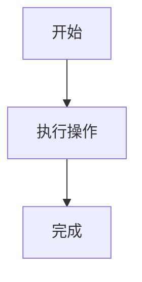
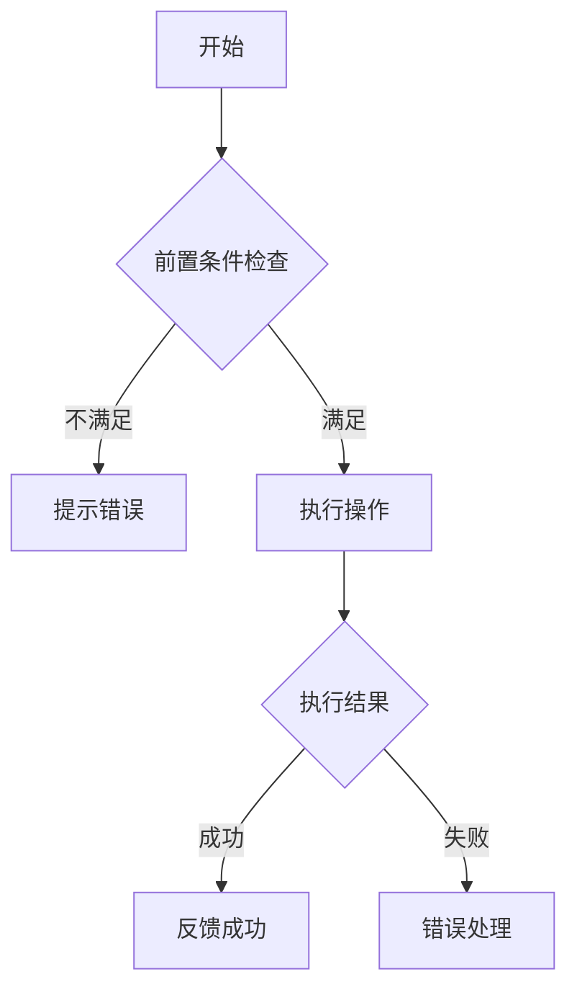

# 策划案常见问题模式库

本文档汇总了编辑器策划案中反复出现的问题模式，帮助评审者快速识别典型问题。

---

## 一、总览章节常见问题

### 问题模式1：价值论证空泛
**典型表现**：
```
❌ "本功能可以提升创作效率"
❌ "对创作者很有帮助"
```
**改进方向**：
```
✅ "将原本需要写50行Lua代码的粒子特效配置，简化为可视化的拖拽面板，预计减少80%的配置时间"
✅ "当前创作者平均需要3天完成地形搭建，本工具可缩短至0.5天"
```

### 问题模式2：目标用户不明确
**典型表现**：
```
❌ "面向所有用户"（实际上不同用户需要不同的复杂度）
```
**改进方向**：
```
✅ "主要面向小白创作者（需要傻瓜式操作），资深开发者可通过API接口进行高级配置"
```

### 问题模式3：竞品分析走过场
**典型表现**：
```
❌ "参考了Unity和Roblox的类似功能"（但没说参考了什么）
```
**改进方向**：
```
✅ "Unity的ProBuilder：优势是实时预览，但缺少Undo支持。我们需要保留实时预览能力，同时确保Ctrl+Z支持"
```

---

## 二、使用流程常见问题

### 问题模式4：操作步骤不连续
**典型表现**：
```
❌ 步骤1→步骤3（跳过了中间的关键操作）
```
**评审方法**：
用"角色扮演法"——假装自己是第一次使用的新人，按步骤操作，看是否能走通

### 问题模式5：遗漏Ctrl+Z支持
**典型表现**：
```
❌ 详细描述了操作步骤，但没提撤销支持
```
**这是编辑器策划案中最常见的遗漏之一**

### 问题模式6：界面设计过于抽象
**典型表现**：
```
❌ "工具面板包含必要的配置选项"（没有具体说明有哪些控件）
```
**改进方向**：
```
✅ 控件清单：
- 输入框：填写名称（限制20字符）
- 滑动条：密度调节（范围0-100，默认50）
- 选择器：选择目标资产（支持StaticMesh类型）
- 按钮：[生成]、[清除]、[预览]
```

---

## 三、逻辑流程常见问题

### 问题模式7：流程图缺少异常分支
**典型表现**：

**改进方向**：


### 问题模式8：用文字描述代替流程图
**典型表现**：
```
❌ "用户先选中物体，然后点击按钮，系统判断是否合法，合法则执行..."
```
**建议**：复杂流程务必使用Mermaid语法的流程图或时序图

### 问题模式9：时序图缺少参与者
**典型表现**：只画了客户端的交互，没有涉及服务端
**评审方法**：对每个操作问"谁发起？谁处理？谁返回？"

---

## 四、数据与架构常见问题

### 问题模式10：数据结构定义不完整
**典型表现**：
```
❌ 只列了字段名：id, name, type, value
```
**改进方向**：
```
✅ 
| 字段名 | 类型 | 必填 | 说明 | 示例 |
|--------|------|------|------|------|
| id | int64 | 是 | 唯一标识 | 10001 |
| name | string(64) | 是 | 显示名称 | "金币礼包" |
| type | enum | 是 | 道具类型 | ITEM/CURRENCY/SKIN |
| value | int32 | 是 | 数量/数值 | 100 |
```

### 问题模式11：存储方案未定义
**典型表现**：
```
❌ "系统会记录用户的配置数据"（但没说存在哪里、什么格式）
```

---

## 五、边界与性能常见问题

### 问题模式12：性能指标缺少量化
**典型表现**：
```
❌ "操作应该流畅"
❌ "支持大量数据"
```
**改进方向**：
```
✅ "拖动滑动条调节密度时需要实时预览（<16ms响应）"
✅ "单次生成上限5000个物体，预计耗时<5秒"
```

### 问题模式13：边界情况考虑不全
**必须考虑的边界场景清单**：
1. 空输入/零值
2. 超大输入/极端值
3. 并发操作
4. 资源丢失/损坏
5. 网络断开（如涉及网络）
6. 权限不足
7. 版本兼容性

### 问题模式14：异常处理只说"报错"
**典型表现**：
```
❌ "如果出错就提示用户"
```
**改进方向**：
```
✅ 异常处理策略：
- 资源丢失：弹出确认框"引用的资产[资产名]已被删除，是否使用默认资产替代？"
- 参数越界：自动钳制到有效范围，并在状态栏提示"数值已调整为有效范围[min-max]"
- 生成失败：回滚已生成的部分物体，弹出详细错误日志
```

---

## 六、跨模块一致性问题

### 问题模式15：前后矛盾
**典型场景**：
- 总览说"面向小白用户"，但操作步骤要求编写脚本
- 使用流程说"支持批量操作"，边界章节未定义批量上限
- 数据结构定义了字段A，但流程图中使用字段B

### 问题模式16：重复或冗余描述
**典型场景**：
- 同一功能在多个章节重复描述，但细节不一致
- 可以合并的章节被分散到多处

---

## 七、评审时的快速检测清单

### 30秒速检（先看全局）
- [ ] 有无标题和版本信息？
- [ ] 有无流程图或时序图？
- [ ] 有无数据结构表？
- [ ] 有无异常处理描述？
- [ ] 总字数是否达标（通常>2000字）？

### 5分钟深检（逐章审查）
- [ ] 总览：痛点→价值→用户→场景，链条是否完整？
- [ ] 流程：步骤能否走通？有无遗漏Ctrl+Z？
- [ ] 架构：流程图是否覆盖异常分支？
- [ ] 数据：字段定义是否有类型和说明？
- [ ] 边界：异常处理是否具体（而非"报错"）？
- [ ] 性能：是否有量化指标？
